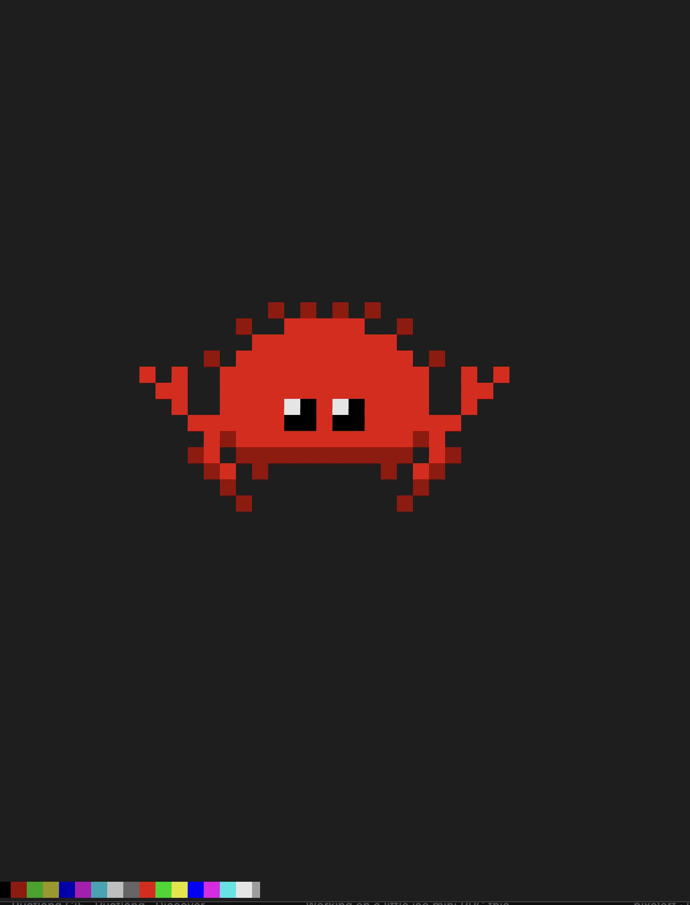

## `pixelrs`

A very simple and minimal `tty` inifinite pixel art editor written in `rust`

- `B` brush
- `E` erase
- `I` ink tool
- `A` text
- `C` open colors
- `M` move
- `Q` quit

supports resize events (hopefully)

```bash
$ git clone git@github.com:ivanbelenky/pixelrs.git
$ cargo run 
```
<!-- scale the image a little bit -->
<p align="center"></p>

## TODO
- [ ] save feature
- [ ] zoom?
